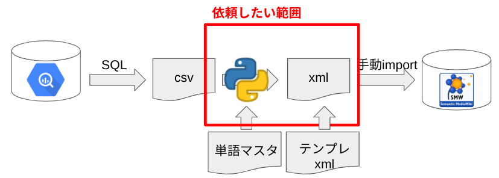

# DLG-knowledge-graph_csv2xml-conversion_specification

# What is this?

- DLGナレッジグラフにおいて、BigQueryに蓄積されているSlack上のデータをSemanticMediaWikiにインポートを目的とする
- BigQueryから出力したcsvデータをxmlへ変換
- 本ドキュメントでは、csvデータとxmlデータの仕様及び変換仕様を示す

# 1. slack csvデータ仕様

|Column name|Data type|Content|
|-----------|---------|-------|
|channel_id |string   |slackのチャンネルID|
|channel_name|string|slackのチャンネル名|
|reply_num|int|talkが属するスレッドへの何個目のリプライか。もとのtalkは0番|
|user_id|string|各talkのuser_id|
|user_name|string|user表示名（発言当時の表示名）|
|reply_user_is_in_current|bool|データ取得時のユーザ在籍有無|
|talk_id|string|各talkのid|
|talk_text|string|各talkの内容|
|talk_ts|datetime|各talkのtimestamp|
|thread_ts|datetime|talkが属するスレッドのtimestamp|
|target_date|date|slackAPI経由でBigQueryにデータが取得された日|

# 2. MediaWiki xmlデータ仕様

- `<page>`タグ以降を編集
    - １つの`<page></page>`タグで１ページ
- 詳細
    - [https://www.mediawiki.org/wiki/Help:Export/ja#書き出しの形式](https://www.mediawiki.org/wiki/Help:Export/ja#%E6%9B%B8%E3%81%8D%E5%87%BA%E3%81%97%E3%81%AE%E5%BD%A2%E5%BC%8F)
- `<title>`: ページのタイトル
    - 今回は"Q&A-xxxx"とする
- `<text>`
    - `{{Infobox Q&A}}`
        - MediaWiki上でのテンプレート
- `<sha1>`
    - インポート時に自動生成されるハッシュ値

# 3. 変換仕様

- １スレッド１ページ（`<page></page>`）とする
    - **30**ページ/1xmlファイルとする
        - インポート時に重すぎるため
- `<title>`: ページのタイトル
    - 今回は"Q&A-xxxx"とする（古い順から連番を付ける、桁数どうしよう）
- `<text>`
    - `{{Infobox Q&A}}`
        - 下記テーブルの通り
    - 質問talk(reply_num=0)の内容は"==質問=="ブロックへ
    - それ以降の返信（reply_num>0）の内容は"==回答=="ブロックへ
        - 回答talkごとにブロックを作れると見やすい？
    - メンションの変換
        - talk中のメンションがuser_idになってしまっているため、表示名に変換する

|パラメータ|表記方法|内容|
|---------|------|----|
|question_channel|特になし|質問したチャンネル名|
|question_date|Date|質問した日付|
|question_member_1|`[[利用者:XXX]]`|質問したメンバーの表示名|
|answer_member_1|`[[利用者:YYY]]`|回答したメンバーの表示名。５人まで追加可能。コメント数→先着順。|
|tech_topic_1|`[[質問トピック::ZZZ]]`|会話の中から単語リストに該当する単語を抽出。５つまで追加可能。出現回数→リスト順。|
